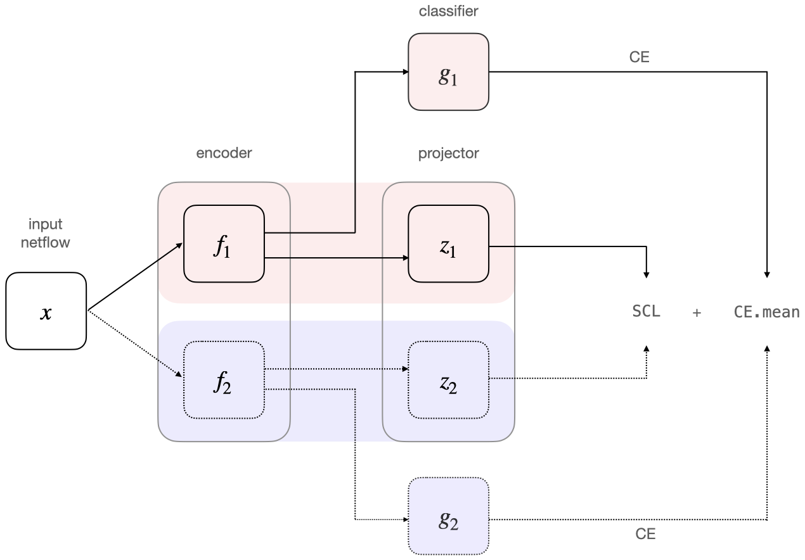

# ConFlow

Paper: [ConFlow: Contrast Network Flow Improving Class-Imbalanced Learning in Network Intrusion Detection](https://assets.researchsquare.com/files/rs-1572776/v1_covered.pdf?c=1651160465)

> To improve class-imbalanced learning in network intrusion detection, it is necessary to capture the similarities between samples in different classes and compare them with samples in other classes. We propose ConFlow, a contrastive learning method for network intrusion detection, and design a deep learning model of the extracted network flow, combining supervised contrastive loss and cross-entropy loss for training. ConFlow can improve class-imbalanced  learning  and further mine malicious attacks hidden under benign traffic. 

- **Flow Encoer**


- **Training framework and loss function**




## Data Preprocessing

(1) **Download Datasets**

```
python data_convert/download.py             # Download datasets  
```

> **ICXS-IDS2012** https://www.unb.ca/cic/datasets/ids.html
>
> - In network intrusion detection (IDS), anomaly-based approaches in particular suffer from accurate evaluation, comparison, and deployment which originates from the scarcity of adequate datasets. Many such datasets are internal and cannot be shared due to privacy issues, others are heavily anonymized and do not reflect current trends, or they lack certain statistical characteristics. These deficiencies are primarily the reasons why a perfect dataset is yet to exist. Thus, researchers must resort to datasets which they can obtain that are often suboptimal.
>
> **UNSW-NB2015** https://www.unsw.adfa.edu.au/unsw-canberra-cyber/cybersecurity/ADFA-NB15-Datasets/
>
> - The raw network packets of the UNSW-NB15 dataset was created by the IXIA PerfectStorm tool in the Cyber Range Lab of the Australian Centre for Cyber Security (ACCS) for generating a hybrid of real modern normal activities and synthetic contemporary attack behaviours.
> - Tcpdump tool is utilised to capture 100 GB of the raw traffic (e.g., Pcap files). This dataset has nine types of attacks, namely, Fuzzers, Analysis, Backdoors, DoS, Exploits, Generic, Reconnaissance, Shellcode and Worms. The Argus, Bro-IDS tools are used and twelve algorithms are developed to generate totally 49 features with the class label.
>
> **CIC-IDS2017** https://www.unb.ca/cic/datasets/ids-2017.html
>
> - The dataset "IDS 2017" contains benign and the most up-to-date common attacks. It reflects a realistic background traffic. This dataset contains the built abstract behaviour of 25 users based on the HTTP, HTTPS, FTP, SSH, and email protocols.
> - The captured data are spitted into 5 PCAP files according to the day of the week they were captured. The data are captured from 3.7.2017 12:00 PM UTC (Monday) to 7.7.2017 8:00 PM UTC (Friday), in local time from Monday 9:00 AM to Friday 5:00 PM. This dataset include Brute Force FTP, Brute Force SSH, DoS, Heartbleed, Web Attack, Infiltration, Botnet and DDoS attacks.


(2) **Data Convert** 

```
data_convert
├── download.py              # Download datasets  
├── ids12
│   ├── 0_pcap_split.py      # Slice pcap
│   ├── 1_label_xml2csv.py   # Convert XML labels to CSV
│   └── 2_pcap2csv.py		 # Convert PCAP to CSV by NFStream
├── ids17
│   └── pcap2csv.py          # Convert PCAP to CSV by NFStream
└── unb15
    ├── label_sort.py        # Sort out ground truth
    └── pcap2csv.py          # Convert PCAP to CSV by NFStream
```


## Running

(1) **Standard Cross-Entropy**

```
python main.py --dataset_name ids17 \
			   --dataset_path datasets/CIC-IDS2017/emb_ids17.csv \
			   --type_classes multiclass \
			   --method ce
```

(2) **Cross-Entropy + Supervised Contrastive Learning**

```
python main.py --dataset_name ids17 \
			   --dataset_path datasets/CIC-IDS2017/emb_ids17.csv \
			   --type_classes multiclass \
			   --method scl+ce
```

(3) **Few-shot learning**

- Only supported classification

```
python main.py --dataset_name ids17 \
			   --dataset_path datasets/CIC-IDS2017/emb_ids17.csv \
			   --type_classes binary \ 
			   --method scl+ce \
			   --fewshot_train True
```

(4) **Cross test**

- Only supported classification

```
python main.py --dataset_name ids17 \
			   --dataset_path datasets/CIC-IDS2017/emb_ids17.csv \
			   --testset_name ids17 \
			   --testset_path datasets/CIC-IDS2017/emb_ids17.csv \
			   --type_classes binary \ 
			   --method scl+ce \
			   --cross_test True \
```


## Result Reports Demo

(1) **Classification Report**

```python
Classification Report
              precision    recall  f1-score   support

      BENIGN     1.0000    0.9999    1.0000    336193
         DoS     0.9997    0.9999    0.9998     35869
    PortScan     1.0000    1.0000    1.0000     31789
        DDoS     0.9999    1.0000    0.9999     16736
     Patator     1.0000    1.0000    1.0000      1391
  Web Attack     0.9975    0.9800    0.9887       401
         Bot     0.9720    0.9878    0.9798       246
Infiltration     1.0000    1.0000    1.0000         6

    accuracy                         0.9999    422631
   macro avg     0.9961    0.9960    0.9960    422631
weighted avg     0.9999    0.9999    0.9999    422631
```


(2) **Confusion matrix**


